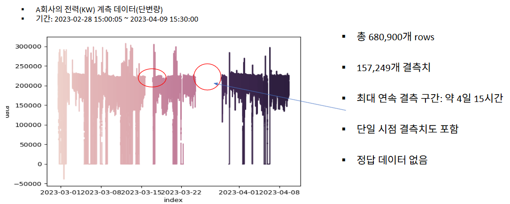
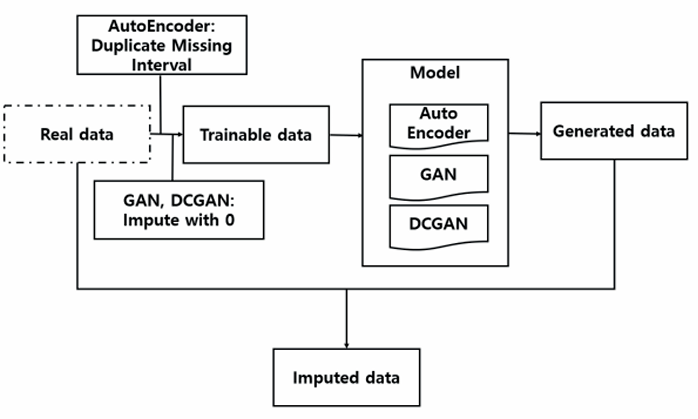

<div align="center">

# 시계열 결측치 보간 파이프라인

### 연속적인 결측 구간을 가진 전력 계측 데이터의 딥러닝 기반 보간

시계열 DB에서 데이터를 조회해 결측을 보간하고 다시 적재하는 파이프라인입니다.
**정답 데이터가 없는 장기 연속 결측** 문제를 다룹니다.


<sub>한국전자기술연구원(KETI) · 한국통신학회 2023 추계종합학술발표회</sub>

</div>

---

## 문제 정의

설비에서 수집되는 전력 계측 데이터는 장비 고장이나 통신 오류로 결측이 발생합니다.
단일 시점의 랜덤 결측은 기존 방법으로도 채울 수 있지만, **며칠씩 이어지는 연속 결측**은
주변 값을 참고할 수 없어 훨씬 어렵습니다.

<div align="center">

</div>

| 항목 | 값 |
|---|---|
| 관측점 수 | 680,900개 (5초 간격, KW 단위 단변량) |
| 결측치 | 157,249개 — 전체의 **23%** |
| 연속 결측 구간 | 5,896개 |
| 최장 결측 구간 | **4일 15시간** |
| 정답 데이터 | **없음** |

정답이 없다는 점이 이 문제의 핵심입니다. 보간 결과를 맞고 틀림으로 채점할 수 없기 때문에,
**원본 데이터의 분포와 통계량을 얼마나 보존하는지**로 평가해야 합니다.

---

## 접근

### 1. 결측 길이에 따른 이원화

모든 결측을 같은 방법으로 채우면 손해입니다. 짧은 구간은 선형 보간으로 충분하고,
긴 구간은 선형 보간을 적용하면 직선이 그어져 원본의 변동성이 사라집니다.

`imputation/imputation.py`의 `short_process`가 이 분기를 담당합니다.

```
연속 결측 길이 < 12  →  선형 보간으로 즉시 채움
연속 결측 길이 ≥ 12  →  inf로 마킹해 보간에서 제외 → 이후 NaN 복원
```

연속 결측을 그룹 번호로 묶어 길이를 센 뒤, 임계값 이상인 그룹만 통째로 제외합니다.
이렇게 남긴 장기 결측 구간이 생성 모델의 처리 대상이 됩니다.

### 2. 장기 결측 — 생성 모델

<div align="center">

</div>

정답이 없으므로 **학습 가능한 형태로 데이터를 가공**하는 것이 관건이었습니다.

| 모델 | 학습 데이터 구성 |
|---|---|
| **AutoEncoder** | 결측 구간 크기만큼 **직전 구간을 복제해 이어 붙여** 원본 크기와 동일하게 맞춤 |
| **GAN / DCGAN** | 결측을 0으로 대치, 10,300 크기 윈도우로 분할해 입력 구성 |

- AutoEncoder는 입력 벡터를 3차원 특징 벡터로 인코딩 후 복원 — 원본 재생성이 목적
- GAN·DCGAN은 각각 1,000차원, 500차원 잠재 벡터를 입력받아 원본 크기의 데이터를 생성
- DCGAN은 기존 `Conv2d` 층을 **`Conv1d`로 변형**해 단변량 시계열에 맞게 재구성

생성된 데이터 중 **원본의 결측 구간과 같은 위치의 값만** 원본에 삽입합니다.

---

## 실험 결과

### 학습 데이터 대비 보간 성능

| 지표 | AutoEncoder | GAN | DCGAN |
|---|:--:|:--:|:--:|
| RMSE ↓ | **28,942** | 56,514 | 53,833 |
| MAE ↓ | **9,656** | 18,116 | 14,871 |
| R² ↑ | **0.94** | 0.68 | 0.70 |

### 원본 대비 통계량 보존

정답이 없으므로 원본과의 분포·통계량 유사도로 정성 평가했습니다.

| 통계량 | 원본 | AutoEncoder | GAN | DCGAN |
|---|---:|---:|---:|---:|
| Mean | 161,128 | **162,882** | 132,550 | 136,483 |
| Std | 92,082 | **85,264** | 107,051 | 119,910 |
| Min | −38,904 | **−38,904** | −385,412 | −385,079 |
| Median | 208,274 | **205,441** | 196,621 | 199,549 |
| Max | 307,604 | 307,604 | 307,604 | 307,604 |

**AutoEncoder가 모든 통계량에서 원본에 가장 근접**했습니다. GAN·DCGAN은 Min이 원본의
10배 가까이 벗어나며 실제 데이터에 없는 값을 만들어냈습니다. 원본 재생성을 목적으로 하는
AutoEncoder의 구조가, 분포 자체를 학습하는 적대적 생성 방식보다 이 문제에 적합했습니다.

---

## 파이프라인

```
TSDB 조회  →  결측 길이 분기  →  보간  →  새 태그명으로 TSDB 재적재
```

`main.py`는 설정된 기간·메트릭으로 시계열 DB에 질의해 데이터프레임을 만들고,
보간을 수행한 뒤 사용자 확인을 거쳐 **원본과 다른 태그명으로** 결과를 다시 적재합니다.
원본을 덮어쓰지 않도록 태그명 중복을 막아 두었습니다.

### 지원 보간 기법

| 방식 | 설명 |
|---|---|
| `interpolated` | 선형·다항 등 pandas 기반 보간 |
| `mice` | 반복적 다중 대치 — Linear / RandomForest / XGBoost / LightGBM 선택 가능 |
| `mean` | 평균 대치 |
| 이동통계 | 이동평균·이동최소·이동최대 기반 채움 |
| `fill_foward_fix` | 결측 구간 직전의 동일 길이 구간을 복제해 채움 |

---

## 실행 방법

```bash
pip install -r requirements.txt
```

`config.json`에서 조회 대상과 기간을 설정합니다.

```json
{
  "query_proccess": {
    "url": "http://your-tsdb-host",
    "port": 4242,
    "api": "/api/query/dps/metric",
    "metric": "YOUR.METRIC.NAME",
    "date": { "start": "2023/10/02-00:00:00", "end": "2023/10/08-00:00:00" }
  }
}
```

```bash
python main.py -i interpolated              # 보간 기법 선택
python main.py -i mice -s 2023/10/02-00:00:00 -e 2023/10/08-00:00:00
python main.py -i mean -sv True             # 조회 결과를 save/ 에 저장
```

| 인자 | 설명 |
|---|---|
| `-c, --config` | 설정 파일 경로 (기본 `config.json`) |
| `-i, --imputer` | 보간 기법 (기본 `interpolated`) |
| `-s, --start` / `-e, --end` | 조회 기간 |
| `-sv, --save` | 조회 데이터 CSV 저장 여부 |

---

## 프로젝트 구조

```
imputation-project/
├── main.py                  # 조회 → 보간 → 재적재 진입점
├── config.json              # TSDB 접속 정보 및 보간기 설정
├── parse_config.py          # 설정 파싱, CLI 인자 병합, 객체 초기화
├── imputation/
│   └── imputation.py            # 결측 길이 분기 및 보간 실행
├── imputer/
│   └── imputer.py               # 보간 기법 구현체
├── utils/
│   └── util.py                  # TSDB 질의·적재, 전처리, 캐싱
├── logger/                  # 로깅 및 시각화
└── docs/                    # 문서용 그림
```

---

## 참고 사항

- **실제 계측 데이터는 저장소에 포함하지 않습니다.** `config.json`의 접속 정보는
  플레이스홀더이며, 사용 환경에 맞게 교체해야 합니다.
- 논문의 AutoEncoder·GAN·DCGAN 학습 코드는 별도 실험 코드로 분리되어 있어
  본 저장소에는 포함되어 있지 않습니다. `imputer/imputer.py`에 호출부만 남아 있습니다.

---

## 논문

**연속적인 결측치가 포함된 시계열 데이터의 딥러닝 기반 보간에 관한 연구**
*A Study on the Deep Learning-Based Interpolation for Time-Series Data with Continuous Missing Values*

이승재, 권동우, 지영민 — 한국전자기술연구원(KETI)
한국통신학회 2023년도 추계종합학술발표회, pp. 765–766

> 본 연구는 산업통상자원부(MOTIE)와 한국에너지기술평가원(KETEP)의 지원을 받아 수행한
> 연구 과제입니다. (RS-2023-00237018)
